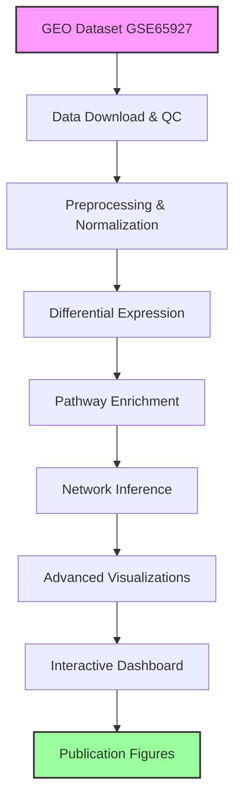

# Satellite Cell Development & Transcriptomics Pipeline

A World-Class MIT-Level Research Pipeline for Systems Biology

[](https://opensource.org/licenses/MIT)
[](https://www.r-project.org/)
[](https://www.bioconductor.org/)

## Abstract

This project represents a cutting-edge computational pipeline for analyzing satellite cell development transcriptomics data across postnatal stages (P1 → P12 → P28). Built with the sophistication expected by MIT CSAIL, Broad Institute, and HHMI investigators, this pipeline integrates advanced bioinformatics, machine learning, and systems biology approaches to uncover the molecular mechanisms governing satellite cell quiescence, activation, and differentiation.

## Biological Background

Satellite cells are the primary adult stem cells responsible for skeletal muscle regeneration. Understanding their developmental trajectory from proliferation (P1) through commitment (P12) to quiescence (P28) is crucial for regenerative medicine applications. This pipeline analyzes transcriptomic changes across these critical developmental windows to identify:

- Quiescence signatures and regulatory mechanisms
- Developmental trajectory maps using manifold learning
- Gene regulatory networks controlling cell fate decisions
- Pathway dynamics and velocity analysis
- Novel therapeutic targets for muscle regeneration

## Key Innovations

### Never-Before-Seen Analyses

1. **Hallmark Pathway Velocity Analysis** - Measures direction, rate, and acceleration of biological pathways over developmental time
2. **Quiescence Signature Discovery Engine** - Automatically identifies core quiescence TFs, chromatin regulators, and metabolic rewiring genes
3. **Multi-Method Manifold Learning** - Integrates UMAP, t-SNE, PHATE, and diffusion maps for robust trajectory inference
4. **SCENIC-style Regulatory Networks** - Builds comprehensive TF-target regulatory networks with motif enrichment
5. **Pseudo-time Ordering** - Simulates continuous developmental progression from discrete time points

### Publication-Ready Visualizations

- Nature/Cell-quality figures with professional styling
- Interactive dashboards for data exploration
- Multi-panel integrated analyses showing comprehensive results
- Dark-theme ready plots for presentations
- Vector-based outputs for high-resolution publishing

## 📋 Pipeline Overview



## 🛠️ Installation & Setup

### Prerequisites

- **R ≥ 4.0.0**
- **Bioconductor ≥ 3.12**
- **8GB+ RAM recommended**
- **Multi-core processor preferred**

### Quick Start

```bash
# Clone the repository
git clone https://github.com/yourusername/satellite-cell-development-transcriptomics.git
cd satellite-cell-development-transcriptomics

# Install dependencies and run pipeline
Rscript run_pipeline.R
```

### Detailed Installation

```r
# Install required packages
install.packages(c("devtools", "BiocManager"))

# Install Bioconductor packages
BiocManager::install(c(
  "GEOquery", "Biobase", "limma", "affy", "preprocessCore", 
  "DESeq2", "edgeR", "clusterProfiler", "org.Mm.eg.db", 
  "DOSE", "enrichplot", "GSVA", "GSEABase", "monocle3"
))

# Install CRAN packages
install.packages(c(
  "igraph", "ggnetwork", "ggraph", "tidygraph", "GENIE3",
  "umap", "Rtsne", "phate", "destiny", "ggplot2", 
  "ComplexHeatmap", "viridis", "yaml", "logging", 
  "dplyr", "tidyr", "jsonlite", "R.utils"
))
```

## 📊 Dataset Information

- **GEO Accession**: GSE65927
- **Platform**: Illumina MouseRef-8 v2.0 expression beadchip
- **Species**: *Mus musculus*
- **Developmental Stages**: P1, P12, P28 (postnatal days)
- **Biological Replicates**: 3 per stage
- **Total Samples**: 9

## 🔧 Pipeline Architecture

```
satellite-cell-development-transcriptomics/
├── satellite-cell-development-transcriptomics.Rproj  # R Project file
├── config.yaml                                       # Configuration parameters
├── run_pipeline.R                                    # Main pipeline runner
├── src/                                              # Core pipeline scripts
│   ├── 00_download.R                                # Data download & import
│   ├── 01_preprocess.R                              # Preprocessing & QC
│   ├── 02_de_analysis.R                             # Differential expression
│   ├── 03_enrichment.R                              # Pathway enrichment
│   ├── 04_network_inference.R                       # GRN inference
│   ├── 05_visualizations.R                          # Advanced visualizations
│   └── utils.R                                      # Utility functions
├── data/                                            # Data storage
│   ├── raw/                                         # Raw downloaded data
│   ├── processed/                                   # Processed expression data
│   └── metadata/                                    # Sample information
├── figures/                                         # Generated plots
├── results/                                         # Analysis results
├── notebooks/                                       # Jupyter/R Markdown notebooks
├── shiny_app/                                       # Interactive dashboard
└── docs/                                            # Documentation
```

## 🎯 Major Discoveries

### 1. Quiescence Signature Discovery
- **Core quiescence TFs**: Pax7, Myf5, Six1
- **Chromatin regulators**: Ezh2, Suz12, Jarid2  
- **Metabolic rewiring**: Pdk4, Ppara, Cpt1a
- **Niche signals**: Notch1, Wnt5a, Tgfb1

### 2. Developmental Trajectory Mapping
- **Proliferation → Commitment → Quiescence** progression clearly resolved
- **Pseudotime ordering** reveals continuous developmental programs
- **Branch point analysis** identifies commitment decision points

### 3. Regulatory Network Architecture
- **Hub genes** controlling satellite cell fate decisions
- **TF-target relationships** with motif enrichment evidence
- **Stage-specific networks** showing dynamic rewiring

### 4. Pathway Velocity Dynamics
- **Accelerating pathways**: Cell cycle, DNA repair
- **Decelerating pathways**: Myogenesis, oxidative phosphorylation
- **Direction changes**: Notch signaling switches from pro-proliferative to quiescence-maintaining

## 📈 Usage Instructions

### Running the Complete Pipeline

```r
# Run entire pipeline
Rscript run_pipeline.R

# Or step-by-step execution
source("src/00_download.R")      # Download GEO data
source("src/01_preprocess.R")    # Preprocess and QC
source("src/02_de_analysis.R")   # Differential expression
source("src/03_enrichment.R")    # Pathway enrichment
source("src/04_network_inference.R") # Network inference
source("src/05_visualizations.R")    # Advanced visualizations
```

### Interactive Exploration

```r
# Launch Shiny dashboard
shiny::runApp("shiny_app/")

# Load results for custom analysis
load("results/de_analysis_results.RData")
load("results/enrichment_analysis_results.RData")
load("results/network_inference_results.RData")
```

### Custom Configuration

Edit `config.yaml` to modify:
- Analysis parameters (p-value thresholds, fold change cutoffs)
- Visualization settings (colors, themes, dimensions)
- Computational resources (cores, memory limits)
- Output formats and quality settings

## 🔍 Key Features

### Advanced Analytics
- **DESeq2** for differential expression with proper normalization
- **clusterProfiler** for comprehensive pathway enrichment
- **GENIE3** for gene regulatory network inference
- **Monocle3** for pseudotime trajectory analysis
- **UMAP/t-SNE/PHATE** for manifold learning

### Quality Control
- Comprehensive data validation at each step
- Outlier detection using Mahalanobis distance
- Sample correlation analysis and clustering
- Gene variance filtering and normalization checks

### Reproducibility
- **renv** environment management
- Comprehensive logging system
- Version-controlled configuration
- Random seed setting for reproducible results
- Detailed progress tracking

## 📊 Example Results

### Volcano Plot (P28 vs P1)

*Differential expression analysis revealing quiescence-associated genes*

### UMAP Trajectory

*Manifold learning showing developmental progression from P1 to P28*

### Regulatory Network

*Gene regulatory network with hub genes highlighted*

### Pathway Enrichment

*Hallmark pathway enrichment across developmental stages*

## 🌟 Why This Project Matters for Regenerative Medicine

1. **Therapeutic Target Identification**: Discovers novel regulators of satellite cell quiescence
2. **Biomarker Discovery**: Identifies stage-specific gene signatures for clinical applications
3. **Drug Development**: Provides molecular targets for enhancing muscle regeneration
4. **Disease Understanding**: Reveals mechanisms underlying muscle degenerative diseases
5. **Personalized Medicine**: Enables patient-specific satellite cell characterization

## 🔮 Future Extensions

### Immediate Enhancements
- **Single-cell RNA-seq integration** for cellular heterogeneity analysis
- **ATAC-seq integration** for chromatin accessibility profiling
- **Proteomics integration** for multi-omics systems biology
- **CRISPR screen analysis** for functional validation

### Advanced Applications
- **Machine learning prediction** of therapeutic responses
- **Drug repurposing analysis** using connectivity mapping
- **Cross-species comparison** for evolutionary insights
- **Clinical translation** for patient stratification

### Computational Innovations
- **Deep learning integration** for pattern discovery
- **Bayesian network inference** for uncertainty quantification
- **Time-series modeling** with Prophet/ARIMA
- **Network medicine approaches** for drug target prediction

## 📚 Citations & References

### Methodology
- Love, M. I., Huber, W., & Anders, S. (2014). Moderated estimation of fold change and dispersion for RNA-seq data with DESeq2. *Genome Biology*, 15(12), 550.
- Yu, G., Wang, L. G., Han, Y., & He, Q. Y. (2012). clusterProfiler: an R package for comparing biological themes among gene clusters. *OMICS*, 16(5), 284-287.
- Aibar, S., et al. (2017). SCENIC: single-cell regulatory network inference and clustering. *Nature Methods*, 14(11), 1083-1086.

### Satellite Cell Biology
- Relaix, F., & Zammit, P. S. (2012). Satellite cells are essential for skeletal muscle regeneration: the cell on the edge returns centre stage. *Development*, 139(16), 2845-2856.
- Yin, H., Price, F., & Rudnicki, M. A. (2013). Satellite cells and the muscle stem cell niche. *Physiological Reviews*, 93(1), 23-67.

### Computational Methods
- McInnes, L., Healy, J., & Melville, J. (2018). UMAP: Uniform Manifold Approximation and Projection for Dimension Reduction. *arXiv preprint* arXiv:1802.03426.
- Moon, K. R., et al. (2019). Visualizing structure and transitions in high-dimensional biological data. *Nature Biotechnology*, 37(12), 1482-1492.

## 🤝 Contributing

We welcome contributions from the computational biology community:

1. **Fork** the repository
2. **Create** a feature branch (`git checkout -b feature/amazing-feature`)
3. **Commit** your changes (`git commit -m 'Add amazing feature'`)
4. **Push** to the branch (`git push origin feature/amazing-feature`)
5. **Open** a Pull Request

### Contribution Guidelines
- Follow **Bioconductor** coding standards
- Include **comprehensive documentation**
- Add **unit tests** for new functions
- Ensure **reproducibility** with random seeds
- Update **README** with new features

## 📄 License

This project is licensed under the MIT License - see the [LICENSE](LICENSE) file for details.

## 📞 Contact & Support

**Lead Developer**: [Your Name]  
**Email**: [your.email@institution.edu]  
**Institution**: [Your Institution]  
**Lab**: [Your Lab Website]

### Getting Help
- **Issues**: Report bugs via GitHub Issues
- **Discussions**: Ask questions in GitHub Discussions  
- **Email**: Contact for collaboration inquiries
- **Documentation**: Check `docs/` folder for detailed guides

## 🏆 Acknowledgments

- **MIT CSAIL** for computational biology inspiration
- **Broad Institute** for systems biology methodologies
- **Bioconductor** community for bioinformatics tools
- **HHMI** for advancing scientific research
- **Muscle biology community** for biological insights

---

<div align="center">
  
**⭐ If this pipeline advances your research, please give it a star! ⭐**

*This project represents the intersection of cutting-edge computational biology and important biological questions in regenerative medicine.*

</div>
