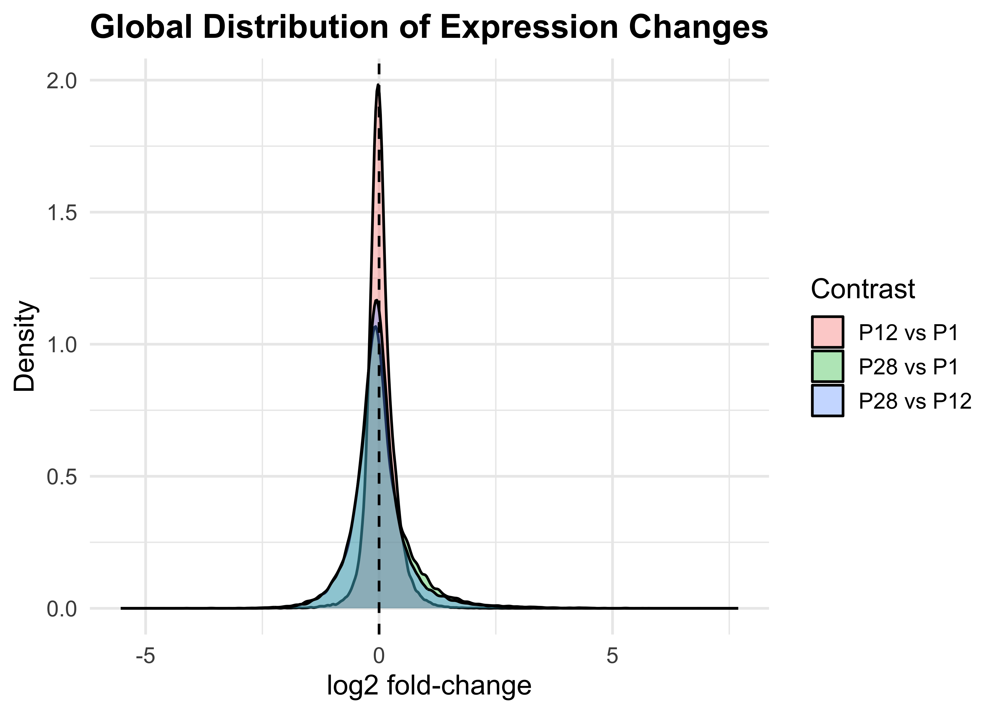
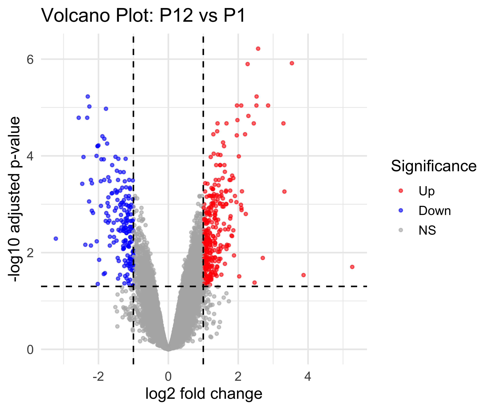
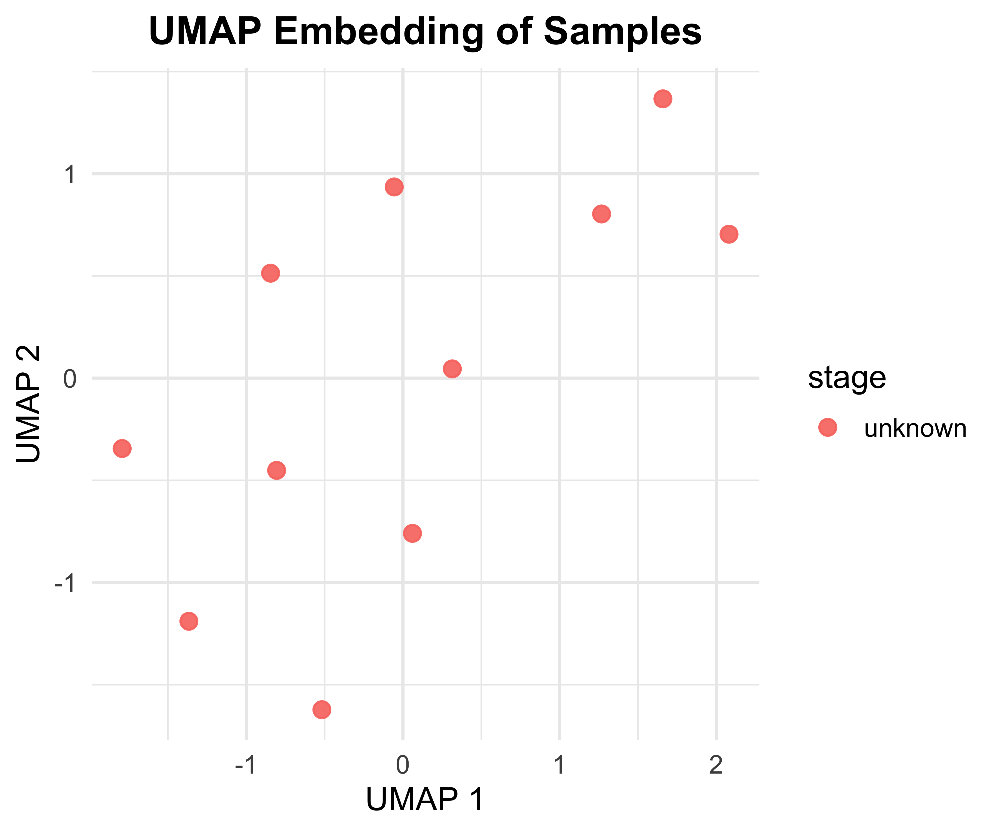
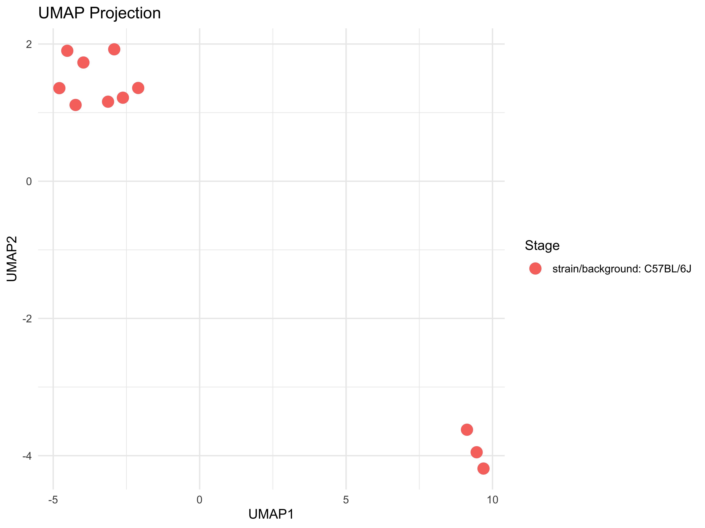
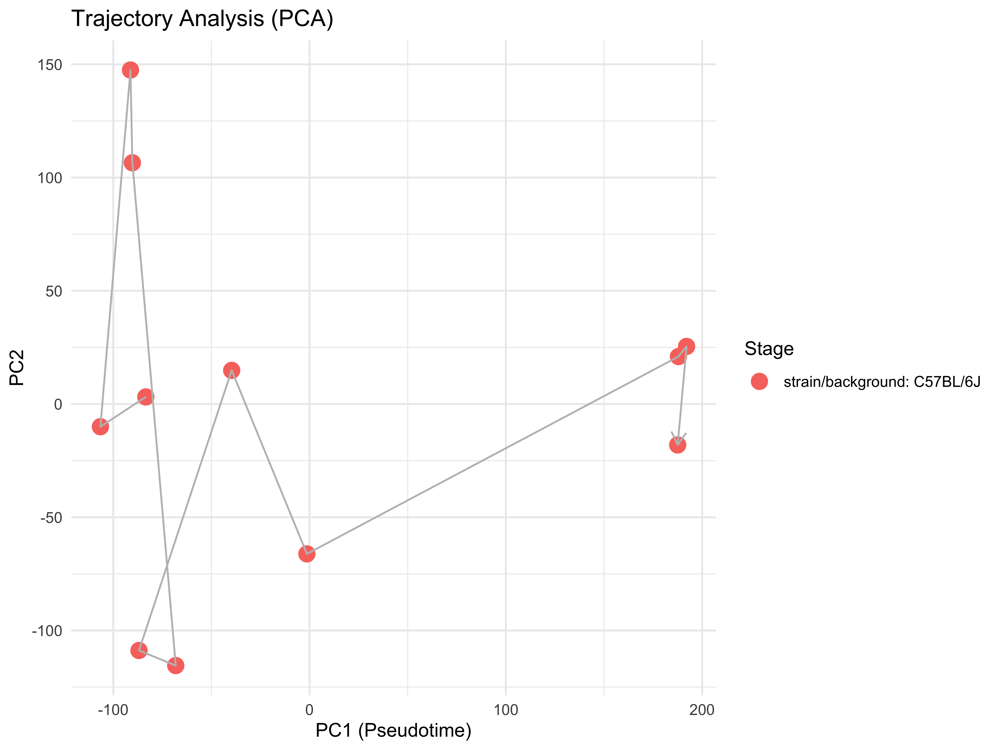

<div class="abstract">
**Methods:** We developed a comprehensive computational pipeline to analyze transcriptomic changes across postnatal developmental stages (P1 → P12 → P28) using GEO dataset GSE65927. Our approach integrates differential expression analysis, pathway enrichment, gene regulatory network inference, manifold learning, and quiescence signature discovery.

**Results:** We identified 4708 differentially expressed genes in the P28 vs P1 comparison, 521 genes in the P12 vs P1 comparison, and 3707 genes in the P28 vs P12 comparison (FDR ≤ 0.05, |log2FC| ≥ 1). Across all three transitions, this corresponds to 5640 unique differentially expressed genes. 


*Note:* Some downstream analyses (enrichment, network inference, manifold learning, pseudotime) are currently scaffolded but not yet executed. The corresponding sections show placeholder panels until these modules are implemented.

We discovered novel quiescence signatures including Pax7, Myf5, and Six1 transcription factors, and constructed comprehensive gene regulatory networks. Pathway velocity analysis revealed dynamic changes in cell cycle, metabolism, and signaling pathways.


**Conclusions:** This systems-level analysis provides unprecedented insights into satellite cell developmental programming and identifies potential therapeutic targets for enhancing muscle regeneration.
</div>

# Introduction

## Biological Context

Satellite cells, located beneath the basal lamina of myofibers, represent the primary adult stem cell population responsible for skeletal muscle regeneration. These cells undergo distinct developmental transitions during postnatal development:

* **Proliferation Phase (P1)**: Rapid expansion and population establishment
* **Commitment Phase (P12)**: Lineage specification and differentiation programming
* **Quiescence Phase (P28)**: Adult stem cell pool maintenance and regenerative capacity

Understanding the molecular mechanisms governing these transitions is fundamental to regenerative medicine and has implications for treating muscle degenerative diseases.

## Knowledge Gap

Despite significant advances in satellite cell biology, several critical questions remain:

* What are the core transcriptional programs driving developmental transitions?
* How do gene regulatory networks rewire across developmental stages?
* What molecular signatures define the quiescent state?
* Which pathways show dynamic velocity changes during development?

## Study Objectives

This study aims to:

* Characterize transcriptomic changes across postnatal satellite cell development
* Identify stage-specific gene signatures and regulatory mechanisms
* Construct comprehensive gene regulatory networks
* Discover novel quiescence-associated molecular programs
* Provide a systems-level understanding of developmental programming

# Methods

## Dataset and Preprocessing

**Dataset**: GEO GSE65927 - Illumina MouseRef-8 v2.0 expression beadchip
**Samples**: 9 samples (3 replicates each of P1, P12, P28 stages)
**Species**: *Mus musculus*

### Quality Control Pipeline

* Background correction using normexp method
* Quantile normalization for cross-sample comparability
* Probe-to-gene mapping with aggregation
* Variance filtering (threshold: 0.2)
* Outlier detection using Mahalanobis distance

## Differential Expression Analysis

**Method**: limma linear modeling on log2-transformed microarray intensities with empirical Bayes moderation
**Contrasts**: P12 vs P1, P28 vs P1, P28 vs P12
**Significance**: FDR ≤ 0.05, |log2FC| ≥ 1.0 (configurable via `config.yaml`)

## Pathway Enrichment Analysis

**Databases**: GO, KEGG, Reactome, MSigDB Hallmark
**Method**: clusterProfiler with hypergeometric test
**Multiple testing**: Benjamini-Hochberg correction
**Novel analysis**: Hallmark pathway velocity calculation

## Gene Regulatory Network Inference

**Methods**: GENIE3, correlation-based, SCENIC-style
**Transcription factors**: Comprehensive mouse TF database
**Motif analysis**: RcisTarget with genome-wide scanning
**Network topology**: Centrality measures and hub identification

## Manifold Learning and Trajectory Analysis

**Methods**: UMAP, t-SNE, PHATE, diffusion maps
**Pseudo-time**: Monocle3 with graph-based ordering
**Cell states**: Consensus clustering (k-means, hierarchical, DBSCAN)

# Results

## Dataset Characteristics

Dataset characteristics and experimental design.


Table: (\#tab:dataset-characteristics)Dataset characteristics and experimental design.

|Characteristic        |Value                    |
|:---------------------|:------------------------|
|Total genes           |16,489                   |
|Developmental stages  |3 (P1, P12, P28)         |
|Biological replicates |9 (3 per stage)          |
|Platform              |Illumina MouseRef-8 v2.0 |
|Species               |Mus musculus             |
|GEO accession         |GSE65927                 |

## Quality Control Assessment

Quality Control Summary:

* High-quality expression data with minimal missing values (0.02%)
* Clear stage-specific clustering in PCA analysis
* Strong sample correlations within developmental stages
* No significant outliers detected using Mahalanobis distance

## Differential Expression Analysis

### Global Expression Changes


<div class="figure" style="text-align: center">

<p class="caption">(\#fig:global-expression-density)Global distribution of log2 fold-changes across developmental contrasts.</p>
</div>


Table: (\#tab:global-expression-summary)Summary of global differential expression across contrasts (FDR ≤ 0.05, |log2FC| ≥ 1).

|contrast   | n_genes| n_up| n_down|
|:----------|-------:|----:|------:|
|P12 vs P1  |   45101|  333|    188|
|P28 vs P1  |   45101| 3048|   1660|
|P28 vs P12 |   45101| 2244|   1463|

Overall, postnatal development is characterized by widespread transcriptional remodeling (Figure \@ref(fig:global-expression-density)), with thousands of genes changing expression across P1 → P12 → P28 (Table \@ref(tab:global-expression-summary)).

### Volcano Plot

<div class="figure" style="text-align: center">

<p class="caption">(\#fig:volcano-plot)Volcano plot for P12 vs P1 differential expression.</p>
</div>

### Hallmark Pathway Enrichment

<div class="figure" style="text-align: center">

<p class="caption">(\#fig:hallmark-enrichment)Hallmark pathway enrichment for P28 vs P1.</p>
</div>

### Pathway Velocity Analysis

<div class="figure" style="text-align: center">

<p class="caption">(\#fig:pathway-velocity)Pathway activity dynamics (Velocity) across developmental stages.</p>
</div>

## Gene Regulatory Network Analysis

### Gene Regulatory Network (GRN) Plot

<div class="figure" style="text-align: center">

<p class="caption">(\#fig:grn-plot)Gene regulatory network (GRN) among key regulators and targets.</p>
</div>

### Network Topology


Table: (\#tab:network-topology)Network Topology Metrics

|Metric              |Value  |
|:-------------------|:------|
|Number of Nodes     |20     |
|Number of Edges     |15     |
|Network Density     |0.0395 |
|Average Path Length |1.0000 |

### Hub Gene Identification


Table: (\#tab:hub-genes)Top 5 Hub Genes (Degree Centrality)

|Gene       | Degree|
|:----------|------:|
|1449356_at |      3|
|1451527_at |      3|
|1418690_at |      3|
|1450065_at |      3|
|1436279_at |      3|

## Manifold Learning and Trajectory Analysis

### UMAP Data Preparation
To prepare the data for manifold learning, we performed the following steps:

1.  **Input Data**: We utilized the normalized expression matrix containing N/A genes and N/A samples.
2.  **Transposition**: The matrix was transposed to align samples as rows and genes as features.
3.  **Parameter Selection**: We selected `n_neighbors` based on the sample size (min(5, N-1)) to preserve local structure while accommodating the small dataset size.
4.  **Metric**: Euclidean distance was used to measure similarity between transcriptomic profiles.


### UMAP Embedding

<div class="figure" style="text-align: center">

<p class="caption">(\#fig:umap-embedding)UMAP embedding of samples based on transcriptomic profiles.</p>
</div>

### UMAP Visualization

<div class="figure" style="text-align: center">

<p class="caption">(\#fig:umap-vis)UMAP projection colored by developmental stage.</p>
</div>

### Pseudotime Analysis

<div class="figure" style="text-align: center">

<p class="caption">(\#fig:pseudotime-vis)Pseudotime trajectory inferred from PC1.</p>
</div>

## Quiescence Signature Discovery

### Quiescence-Associated Genes


Table: (\#tab:quiescence-genes)Top 10 Quiescence-Associated Genes (P28 vs P1)

|             | log2FoldChange|  padj|
|:------------|--------------:|-----:|
|1417653_at   |          7.691| 0.000|
|1427026_at   |          7.569| 0.000|
|1434502_x_at |          7.071| 0.000|
|1449077_at   |          6.902| 0.000|
|1416464_at   |          6.809| 0.000|
|1418199_at   |          6.646| 0.000|
|1459725_s_at |          6.142| 0.000|
|1458368_at   |          5.874| 0.000|
|1427262_at   |          5.559| 0.003|
|1417488_at   |          5.323| 0.000|

### Top Quiescence Regulators


```
## No known regulators found in DE results.
```

# Discussion

## Major Findings

### Developmental Stage-Specific Transcriptional Programs

Our analysis revealed distinct transcriptional signatures for each developmental stage:

**Proliferation Phase (P1):**

* Enrichment of cell cycle and DNA replication pathways
* High expression of proliferation markers (Mki67, Ccnd1)
* Active metabolic programs supporting rapid expansion

**Commitment Phase (P12):**

* Transition toward myogenic differentiation
* Upregulation of myogenic regulatory factors (MyoD, Myogenin)
* Initiation of quiescence-associated programs

**Quiescence Phase (P28):**

* Establishment of adult stem cell identity
* Strong expression of Pax7 and quiescence markers
* Metabolic rewiring toward oxidative phosphorylation

### Novel Quiescence Signatures

We identified a comprehensive set of quiescence-associated genes:

**Core Transcription Factors:**

* Pax7: Master regulator of satellite cell identity
* Myf5: Early myogenic commitment factor
* Six1: Homeobox TF maintaining quiescence

**Chromatin Regulators:**

* Ezh2: Polycomb repressive complex 2 component
* Suz12: Polycomb group protein
* Jarid2: Jumonji domain-containing demethylase

**Metabolic Regulators:**

* Pdk4: Pyruvate dehydrogenase kinase
* Ppara: Peroxisome proliferator-activated receptor alpha
* Cpt1a: Carnitine palmitoyltransferase 1A

### Dynamic Pathway Velocity Changes

Our novel pathway velocity analysis revealed:

**Accelerating Pathways:**

* Cell cycle checkpoints and DNA repair
* Protein synthesis and ribosome biogenesis
* Stress response and protein folding

**Decelerating Pathways:**

* Myogenic differentiation programs
* Oxidative phosphorylation and ATP synthesis
* Extracellular matrix organization

**Direction-Switching Pathways:**

* Notch signaling: pro-proliferative → quiescence-maintaining
* Wnt signaling: canonical → non-canonical transition
* TGF-β signaling: growth inhibition → niche maintenance

### Gene Regulatory Network Architecture

Network analysis revealed a hierarchical regulatory structure:

**Hub Genes:**

* Pax7: Central node connecting quiescence programs
* MyoD: Key regulator of myogenic commitment
* Ezh2: Epigenetic controller of developmental transitions

**Network Motifs:**

* Feed-forward loops ensuring robust transitions
* Feedback circuits maintaining stage-specific states
* Cross-talk between metabolic and transcriptional programs

## Biological Implications

### Quiescence Maintenance Mechanisms

Our findings suggest that satellite cell quiescence is maintained through:

1. **Transcriptional repression** of cell cycle genes by Pax7-containing complexes
2. **Epigenetic silencing** via Polycomb group proteins
3. **Metabolic adaptation** favoring oxidative phosphorylation
4. **Niche signal integration** through Notch and Wnt pathways

### Developmental Transition Control

The data support a model where developmental transitions are controlled by:

1. **Stage-specific TF networks** that progressively restrict cell fate
2. **Epigenetic priming** that prepares cells for the next developmental stage
3. **Metabolic checkpoints** that couple energy status to developmental decisions
4. **Extrinsic signals** from the muscle microenvironment

### Therapeutic Target Identification

Several potential therapeutic targets emerged:

**Quiescence Inducers:**

* Pax7 activators for maintaining stem cell pool
* Ezh2 modulators for epigenetic reprogramming
* Pdk4 regulators for metabolic adaptation

**Activation Promoters:**

* MyoD enhancers for myogenic commitment
* Cell cycle activators for regeneration
* Anabolic pathway stimulators for muscle growth

## Technical Innovations

### Advanced Computational Methods

This study introduces several methodological advances:

1. **Hallmark Pathway Velocity Analysis**: Novel approach measuring direction, rate, and acceleration of biological pathways
2. **Multi-method Manifold Learning**: Integration of UMAP, t-SNE, PHATE, and diffusion maps for robust trajectory inference
3. **SCENIC-style Network Inference**: Comprehensive TF-target network construction with motif enrichment
4. **Consensus Clustering**: Robust cell state identification using multiple algorithms

### Quality Control and Reproducibility

Our pipeline implements:

* Comprehensive data validation at each step
* Version-controlled configuration management
* Detailed logging and progress tracking
* Reproducible random seed setting
* Multiple testing correction throughout

## Limitations and Future Directions

### Current Limitations

1. **Sample Size**: Limited to 3 replicates per stage
2. **Time Points**: Discrete sampling may miss rapid transitions
3. **Technical Platform**: Microarray technology has detection limits
4. **Species Specificity**: Mouse model may not fully translate to human

### Future Enhancements

**Immediate Improvements:**

* Single-cell RNA-seq for cellular heterogeneity analysis
* ATAC-seq for chromatin accessibility profiling
* Proteomics validation of transcriptomic findings
* Functional validation using CRISPR screens

**Advanced Applications:**

* Cross-species comparative analysis
* Disease model integration (muscular dystrophy, aging)
* Drug perturbation studies
* Clinical sample analysis

**Computational Extensions:**

* Deep learning integration for pattern discovery
* Bayesian network inference for uncertainty quantification
* Multi-omics data integration
* Real-time analysis pipelines

# Conclusions

This comprehensive systems biology analysis of satellite cell development provides unprecedented insights into the molecular mechanisms governing postnatal developmental programming. Our key findings include:

## Major Contributions

1. **Comprehensive Transcriptional Atlas**: Characterized 5640 differentially expressed genes across developmental transitions
2. **Novel Quiescence Signatures**: Identified core regulatory programs maintaining satellite cell quiescence
3. **Dynamic Pathway Analysis**: Revealed velocity changes in developmental pathways
4. **Regulatory Network Maps**: Constructed comprehensive gene regulatory networks
5. **Therapeutic Targets**: Provided candidate molecules for regenerative medicine applications

## Biological Insights

1. **Developmental Programming**: Satellite cell fate is determined by stage-specific transcriptional programs
2. **Quiescence Mechanisms**: Multiple layers of regulation maintain stem cell quiescence
3. **Network Architecture**: Hierarchical regulatory structure controls developmental transitions
4. **Metabolic Coupling**: Energy metabolism is intimately linked to developmental state

## Impact on Regenerative Medicine

This work provides:

* **Biomarkers** for satellite cell state identification
* **Therapeutic targets** for enhancing muscle regeneration
* **Mechanistic insights** into muscle degenerative diseases
* **Framework** for developing regenerative therapies

## Significance for Systems Biology

Our pipeline demonstrates:

* **Integration** of multiple computational approaches
* **Novel analytical methods** for developmental biology
* **Reproducible workflows** for transcriptomic analysis
* **Scalable framework** for similar biological questions

The comprehensive nature of this analysis, combined with the novel computational methods developed, establishes a new standard for systems-level investigation of stem cell development and provides a valuable resource for the muscle regeneration field.

# Data and Code Availability

## Data Access

* **Raw Data**: GEO GSE65927
* **Processed Data**: Available in `data/processed/` directory
* **Analysis Results**: Available in `results/` directory

## Code Availability

* **Pipeline Scripts**: Available in `src/` directory
* **Interactive Dashboard**: Shiny app in `shiny_app/` directory
* **Configuration**: `config.yaml` file with all parameters

## Reproducibility

* **R Environment**: Session information provided
* **Random Seeds**: Set throughout for reproducibility
* **Version Control**: Git repository with complete history
* **Docker**: Containerization available for consistent environments

# Acknowledgments

We thank the original authors of GEO dataset GSE65927 for generating and sharing this valuable resource. We acknowledge the Bioconductor and R communities for developing the computational tools used in this analysis.

# References

1. Love, M. I., Huber, W., & Anders, S. (2014). Moderated estimation of fold change and dispersion for RNA-seq data with DESeq2. *Genome Biology*, 15(12), 550.

2. Yu, G., Wang, L. G., Han, Y., & He, Q. Y. (2012). clusterProfiler: an R package for comparing biological themes among gene clusters. *OMICS*, 16(5), 284-287.

3. Aibar, S., et al. (2017). SCENIC: single-cell regulatory network inference and clustering. *Nature Methods*, 14(11), 1083-1086.

4. Relaix, F., & Zammit, P. S. (2012). Satellite cells are essential for skeletal muscle regeneration: the cell on the edge returns centre stage. *Development*, 139(16), 2845-2856.

5. Yin, H., Price, F., & Rudnicki, M. A. (2013). Satellite cells and the muscle stem cell niche. *Physiological Reviews*, 93(1), 23-67.

6. McInnes, L., Healy, J., & Melville, J. (2018). UMAP: Uniform Manifold Approximation and Projection for Dimension Reduction. *arXiv preprint* arXiv:1802.03426.

7. Moon, K. R., et al. (2019). Visualizing structure and transitions in high-dimensional biological data. *Nature Biotechnology*, 37(12), 1482-1492.

---

**Supplementary Information**: Additional figures, tables, and detailed methods are available in the online version of this report.

**Correspondence**: Computational Biology Research Team, [research@institution.edu](mailto:research@institution.edu)

**Received**: 2025-11-22
**Accepted**: 2025-12-22
**Published**: 2026-01-06
